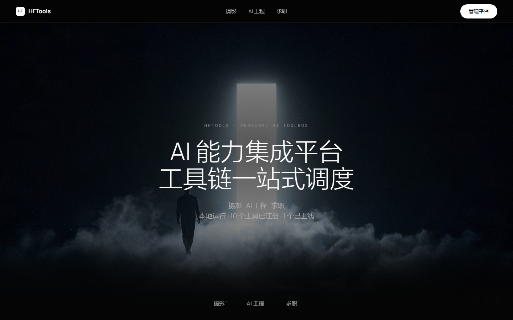
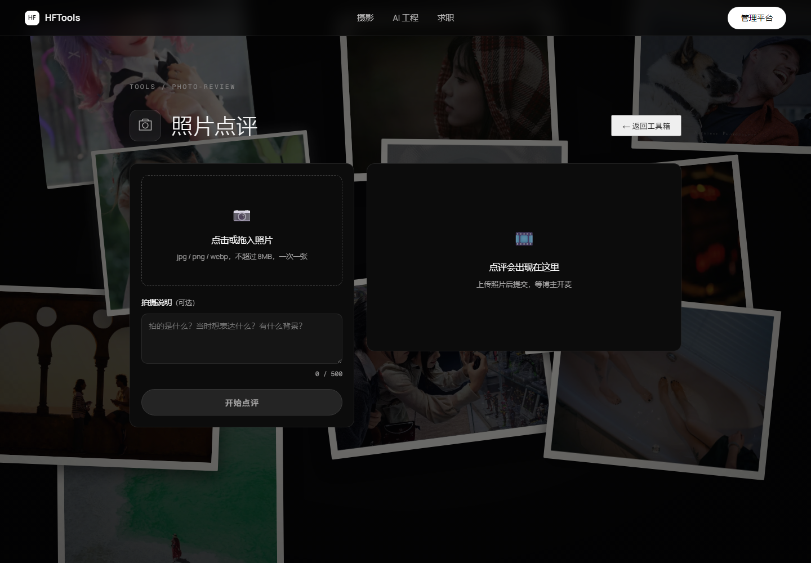
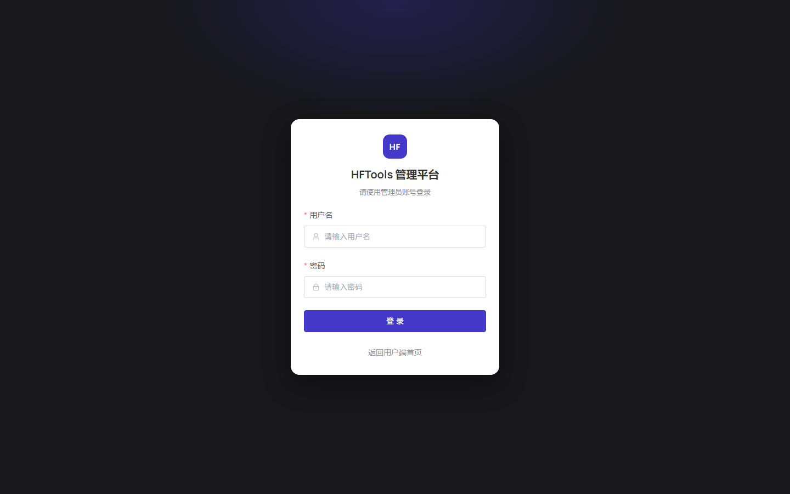

# HFTools · 个人 AI 能力集成平台

> AI 能力集成平台 · 工具链一站式调度 —— 一个面向个人使用的 AI 工具箱。
> 把常用 AI 能力（多模态 LLM、生图、联网搜索、Dify 应用编排）封装成开箱即用的工具，并配套统一管理后台。

本项目是个人「vibe coding」实践项目，以工具箱为概念，统一封装、调度各类 AI 工具，可作为 AI 应用工程化的完整示例。

---

## ✨ 功能总览

按 `摄影 / AI 工程 / 求职` 三大主题规划 10 个工具，均以"注册制"接入平台，可在管理端一键控制显隐：

| 分类 | 工具 | 状态 |
| ---- | ---- | ---- |
| 摄影 | 照片点评 | ✅ 已上线 |
| 摄影 | 照片 AI 优化 | 🚧 开发中（placeholder） |
| 摄影 | 摄影器材参数 | 🚧 开发中 |
| 摄影 | 摄影基础知识 | 🚧 开发中 |
| AI 工程 | 提示词优化 | ✅ 已上线 |
| AI 工程 | AI 工具下载 / 介绍 | 🚧 开发中 |
| AI 工程 | git 热点追踪 | 🚧 开发中 |
| 求职 | JD 拆解 | 🚧 开发中 |
| 求职 | 简历优化 | 🚧 开发中 |
| 求职 | 公司背调 | 🚧 开发中 |

> 状态可在「管理平台 → 工具管理」中动态切换；placeholder 工具对应占位页，上线后替换为正式页面。

---

## 🖼️ 界面预览

| 用户端 · 首页首屏 | 照片点评 | 管理平台 · 登录 |
| --- | --- | --- |
|  |  |  |

> 截图说明：首页为深色影棚风格首屏；照片点评内置照片墙背景 + 多模态 LLM 分析与 Markdown 点评渲染；管理平台以独立登录入口进入，负责工具开关与 LLM/生图/Dify 统一配置。

---

## 🧱 技术架构

- **部署形态**：单机本地运行（不对外开放），`docker-compose` 编排；Dify 复用本地已有部署，经 API 调用
- **工程结构**：monorepo（`frontend` / `server-node` / `worker-python`）
- **后端**：Node.js 作为 **API 网关**（Express + SQLite），承载全部面向前端接口与 AI 调用代理；Python（`worker-python`）承担文档解析、图片处理等生态优势任务（暂未接入编排）
- **前端**：Vue3 + Vite + Pinia + Vue Router，UI 组件库 Element Plus；用户端与管理平台同仓
- **数据库**：SQLite（工具开关、模型配置、内容数据），`better-sqlite3`
- **模型接入**：OpenAI 兼容接口直连 LLM/生图模型；复杂多步流程可选走 Dify

```
hftools/
├── frontend/          # Vue3 前端（用户端 + 管理平台）
├── server-node/       # Node API 网关 + SQLite + AI 调用代理
│   ├── src/
│   │   ├── routes/    # REST 路由（tools / ai / admin / health）
│   │   ├── services/  # LLM 客户端、照片点评、模型配置、加密等
│   │   └── db/        # SQLite 初始化与种子数据
│   └── assets/        # skill 资产与静态资源（照片点评 prompt、动图等）
├── worker-python/     # Python 任务（预留）
├── docker-compose.yml # 单机编排
└── AGENTS.md          # 项目规范与阶段成果
```

---

## 🚀 快速开始（本地开发）

> 前置依赖：Node.js ≥ 20、pnpm、（可选）本地已部署的 Dify。

```bash
# 1. 安装依赖（仓库根目录，pnpm workspace）
pnpm install

# 2. 启动前后端（前端 5173 / 后端 3001）
pnpm dev
```

服务地址：

| 服务 | 地址 |
| ---- | ---- |
| 用户端首页 | http://localhost:5173 |
| 管理平台登录 | http://localhost:5173/admin/login |
| 后端 API | http://localhost:3001/api |

> 首次启动若数据库无管理员，会自动创建默认账号 **`admin` / `admin123`**（登录后请在管理端修改）。
> 若分别启动：`pnpm dev:api`（后端）、`pnpm dev:web`（前端）。

### 模型配置

在【管理平台 → 模型配置】中统一配置（建议先完成配置，工具才能正常调用 AI）：

- **LLM**：OpenAI 兼容的 `base_url`、`api_key`、模型名 —— 照片点评、提示词优化等单轮能力直连调用
- **生图**：支持图生图（img2img）的生图模型 —— 照片 AI 优化等能力使用
- **Dify**：多步骤流程（如简历优化）走 Dify 应用接口

> ⚠️ 安全说明：前端零密钥，所有 AI/外部 API 调用均经后端代理；`api_key` 在管理端保存后经 **AES 加密落盘**（`SECRET_KEY` 可环境变量覆盖）；`.env`、`*.db` 一律不纳入版本管理。

---

## ✍️ 提示词优化

提示词优化将草稿提示词改写为可直接复用的高质量提示词，适用于文本写作、图片生成、视频生成与 Code/技术任务。

- **访问路径**：`/tools/prompt-engineering`
- **提示词级别**：用户提示词（`user`）、系统提示词（`system`）
- **应用场景**：文本（`text`）、图片（`image`）、视频（`video`）、Code（`code`）
- **输入限制**：单次最多 `500` 字符，内置快速开始示例与一键清空
- **输出内容**：优化后提示词与关键改动说明表格，支持复制及下载 Markdown 文件
- **处理方式**：按通用基础模板、提示词级别和应用场景组合优化策略，单轮调用已配置的 LLM；不保存用户输入和优化结果

---

## 🐳 Docker 部署

Dify 复用本地已有部署（经 API 调用，不纳入本编排）；`worker-python` 暂不纳入。

```bash
docker-compose up --build -d
```

| 服务 | 端口 | 说明 |
| ---- | ---- | ---- |
| frontend | 8080（nginx，`/api` 反代到网关） | 前端静态托管 |
| server-node | 3001（数据卷挂载 `./server-node/data`） | API 网关 + SQLite |

---

## 🔧 常用命令

```bash
# 后端（tsx watch 热更新）
pnpm dev:api

# 前端（vite 热更新）
pnpm dev:web

# 生产构建
cd frontend && pnpm build

# 单元/类型检查入口（前端）
cd frontend && pnpm exec vue-tsc -b
```

---

## 📄 License

本项目仅供个人学习与作品展示使用。